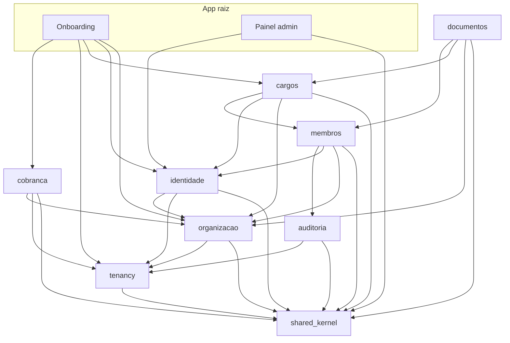

# Arquitetura do Lumio

## Contexto
O Lumio é um ERP de gestão de igrejas vendido como SaaS. Cada cliente (um ministério, um Campo ou uma igreja independente) é um **tenant**. Não existe uma estrutura hierárquica única entre denominações, então a hierarquia é **dado configurado pela organização**, e não código.

Restrições que guiam tudo:
- Uma pessoa desenvolve o produto, com agentes de IA. Simplicidade operacional vale mais que escala teórica.
- Não há API pública. A única integração externa é o gateway de pagamento.
- Dados pessoais e de disciplina são sensíveis (LGPD).

## Visão geral

A seta significa "depende de". O grafo é acíclico e o `packwerk validate` garante isso.
**Proposta de packs**: os nomes vieram dos épicos do backlog. Se mudar, atualize esta tabela, o `AGENTS.md` da raiz e o `package.yml` do pack.

## Monolito modular (ADR-0001)
- Código de domínio em `packs/<nome>/`, com `app/public/` como única superfície visível aos outros packs.
- Cada pack expõe uma fachada `<Pack>::Api` em `app/public`. Os outros packs chamam a fachada, nunca models internos.
- Controllers e páginas Inertia ficam dentro do pack dono da tela.
- `package_todo.yml` só pode diminuir.

## Multi-tenancy (ADR-0002)
- **Um schema PostgreSQL por tenant** (`tenant_<id>`). O `search_path` é `tenant_<id>, public`.
- `public` guarda o que é global: `tenants`, `usuarios`, fila, cache, registro de chamadas externas e dados de cobrança.
- O schema do tenant guarda a organização e tudo abaixo dela: unidades, perfis, vínculos, membros, cargos e documentos.
- Um usuário (em `public`) pode ter vínculos em vários tenants. Ele escolhe o tenant no login, e o vínculo é revalidado a cada requisição.
- Toda troca de schema passa por `Tenancy::Api.com_tenant(id) { ... }`, que restaura o schema anterior mesmo quando há exceção.
- Jobs recebem `tenant_id` e entram no tenant antes de fazer qualquer coisa. Chaves de cache recebem o prefixo `t:<id>:`.
- Migrations de tenant ficam em `db/tenant_migrate/` e rodam via `bin/rails tenants:migrate`. Cada schema tem a própria `schema_migrations`.

## Organização agnóstica (ADR-0005)
- `organizacoes.configuracao` (jsonb) e `tipos_unidade` definem a hierarquia de cada cliente.
- `unidades.caminho` usa `ltree`, e "tudo abaixo de X" é uma consulta indexada (`caminho <@ X`).
- Os tipos têm flags de comportamento (`recebe_membros`, `pode_ser_sede`, `gera_carta`, `assina_cartas`...). As regras consultam essas flags.
- Os nomes exibidos vêm de `Organizacao::Termos`, compartilhados com o front via `inertia_share`.

## Acesso
- `perfis` (conjunto de permissões) + `vinculos` (usuário, perfil, unidade).
- O escopo de um vínculo é a unidade dele e toda a subárvore. As policies filtram por `caminho`.
- Ninguém concede permissão que não tem, e toda unidade mantém ao menos um administrador.

## Eventos (ADR-0003)
- `SharedKernel::Eventos.publicar` só é aceito dentro de transação.
- Handlers **só enfileiram jobs**. Com `enqueue_after_transaction_commit = false` e o Solid Queue no mesmo banco, o job é gravado na mesma transação: se ela sofre rollback, o job some junto.
- As assinaturas ficam num mapa central (`config/initializers/eventos.rb`).

## Dados e infraestrutura (ADR-0004)
- Só PostgreSQL. Não há Redis. Solid Queue e Solid Cache ficam no banco principal, com autovacuum agressivo nas tabelas deles.
- Extensões: `ltree` e `pg_trgm` (busca de membro por nome com índice GIN).
- Campos sensíveis usam Active Record Encryption.

## Cobrança (ADR-0006)
- O gateway ainda está em decisão (Vindi x Asaas). O cartão é tokenizado no navegador ou em página hospedada.
- O webhook confirma a origem, deduplica e enfileira um job. O status real sempre vem da API do gateway, e uma reconciliação roda todo dia.

## Cargos e documentos (ADR-0007)
- Um cargo é ocupado por meio de `ocupacoes_cargo` com vigência. O sistema não deriva cargos de outros dados.
- Os signatários de uma carta são buscados subindo a árvore e ficam **congelados** na emissão.
- Os modelos usam Liquid, que não executa código. O PDF é gerado com Prawn.

## Deploy
- Kamal com os papéis `web` e `job`. Só o `web` roda migration.
- Segredos vêm do gerenciador de senhas.
